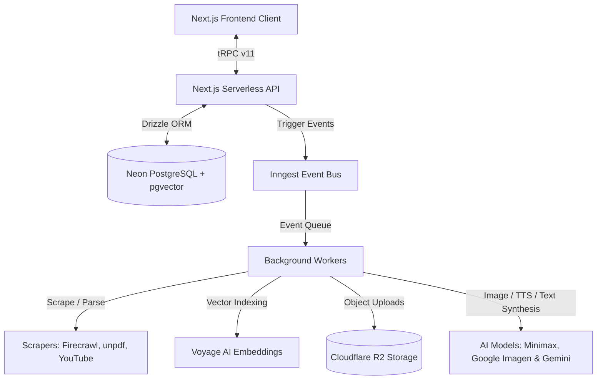

# SourceMind 🧠

SourceMind is a serverless, event-driven, multimodal RAG (Retrieval-Augmented Generation) and knowledge synthesis platform. It allows users to ingest raw document materials—ranging from PDFs and YouTube videos to scraped Javascript-heavy URLs, codebases, and images—and perform semantic queries or synthesize interactive learning assets like mindmaps, quizzes, audio podcasts, and infographics.

---

## 🏗️ Architectural Overview

SourceMind is engineered on a fully decoupled, serverless topology that separates client presentation, synchronous API routing, and event-driven background queues.



---

## ⚡ Core Engineering Features

### 1. Decoupled Background Job Pipeline (Inngest)
Heavy processes like web scraping, OCR document extraction, and image rendering are handled by **Inngest** workers. This event-driven system decouples HTTP requests from long-running tasks:
- **No timeouts:** Next.js Serverless Functions trigger an event and return immediately. The worker picks it up, runs it through sequential steps, and updates the database.
- **Concurrency & Rate Limit Control:** Inngest manages model API rate limits (e.g. Gemini, Imagen, Minimax) through queues and retry limits.

### 2. Multi-Format Knowledge Ingestion Engine
SourceMind ingests data from multiple formats, processes it into raw markdown, and chunks it for semantic indexing:
- **Websites (Firecrawl):** Scrapes JavaScript-rendered web pages, bypasses anti-bot screens, and returns structured markdown files.
- **PDFs & Documents (unpdf / Mammoth):** Parses layout coordinates, parses tables, and reads raw textual contexts.
- **Code Repositories:** Processes code file syntax, formatting file boundaries and structural contexts.
- **YouTube Videos:** Downloads speech transcripts matching video timestamps.
- **Images:** Conducts image detail summaries for ingestion.

### 3. Vector Similarity Search (HNSW RAG)
Once documents are ingested:
- Text content is broken down into semantic sections via recursive chunking.
- **Voyage AI (`voyage/voyage-4-lite`)** generates dense 1024-dimension float vectors for each text chunk.
- Vectors are stored in a Neon PostgreSQL database using `pgvector`.
- Semantic search is accelerated using **HNSW (Hierarchical Navigable Small World)** indexing.
- Chat queries use **Cosine Distance** formulas directly inside Drizzle queries to retrieve context chunks and construct citations in milliseconds.

### 4. Generative Knowledge Synthesis System
Users can synthesize interactive assets from their source materials:
- **Infographics:** Renders high-fidelity `16:9` infographics using the **Google Imagen 4.0 Ultra** model (`google/imagen-4.0-ultra-generate-001`) via the Vercel AI SDK and AI Gateway.
- **Podcast Summaries (TTS):** Generates two-host podcast conversations. Uses **Gemini 3.1 Flash Speech** (`gemini-3.1-flash-tts-preview`) to synthesize multi-speaker speech (`Kore` and `Puck` voices) outputting PCM audio packaged in custom standard WAV header formats.
- **Mindmaps:** Formulates interactive tree diagrams structured with nodes and edges.
- **Quizzes, Flashcards & Markdown Reports:** Renders visual learning cards, tests, and documents powered by **Minimax-m2.5** text models.

---

## ⚙️ Technology Stack

- **Frontend:** Next.js 16 (App Router), React 19, Framer Motion, Tailwind CSS, Base-UI
- **Backend Communication:** tRPC (v11), React Query (v5), Server Actions
- **Database Layer:** Neon Serverless PostgreSQL, Drizzle ORM / Kit, pgvector
- **Asset Storage:** Cloudflare R2 S3-Compatible Storage, AWS S3 SDK
- **Task Scheduling:** Inngest Dev Server & SDK
- **AI Integrations:** Vercel AI SDK Core (`ai`), `@ai-sdk/google`, `@google/genai` (Native SDK), Vercel AI Gateway

---

## 🚀 Getting Started (Local Development)

### 1. Clone & Install Dependencies
```bash
git clone https://github.com/SohamShirke473/sourcemind.git
cd sourcemind
pnpm install
```

### 2. Configure Environment Variables
Copy the template file `.env.example` and set up the keys inside your `.env.local`:
```bash
cp .env.example .env.local
```
*(Refer to the [.env.example](.env.example) file for detailed descriptions of each required credentials block).*

### 3. Set Up Database Schema
Apply database schemas and migration syncs:
```bash
pnpm db:push
```

### 4. Run Development Servers
Start both the Next.js frontend development server and the Inngest background event server:
```bash
# Terminal A: Start Next.js Development Server
pnpm dev

# Terminal B: Start Inngest local dev client
npx inngest-cli@latest dev
```
Open [http://localhost:3000](http://localhost:3000) to view the application workspace.
